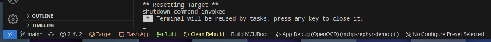

# Zephyr Example Application

This repository contains a Zephyr example application. The main purpose of this
repository is to serve as a reference on how to structure Zephyr-based
applications. Some of the features demonstrated in this example are:

- Basic [Zephyr application][app_dev] skeleton
- [Zephyr workspace applications][workspace_app]
- [Zephyr modules][modules]
- [West T2 topology][west_t2]
- [Custom boards][board_porting]
- Custom [devicetree bindings][bindings]
- Out-of-tree [drivers][drivers]
- Out-of-tree libraries
- Example CI configuration (using Github Actions)
- Custom [west extension][west_ext]

This repository is versioned together with the [Zephyr main tree][zephyr]. This
means that every time that Zephyr is tagged, this repository is tagged as well
with the same version number, and the [manifest](west.yml) entry for `zephyr`
will point to the corresponding Zephyr tag. For example, the `example-application`
v2.6.0 will point to Zephyr v2.6.0. Note that the `main` branch always
points to the development branch of Zephyr, also `main`.

[app_dev]: https://docs.zephyrproject.org/latest/develop/application/index.html
[workspace_app]: https://docs.zephyrproject.org/latest/develop/application/index.html#zephyr-workspace-app
[modules]: https://docs.zephyrproject.org/latest/develop/modules.html
[west_t2]: https://docs.zephyrproject.org/latest/develop/west/workspaces.html#west-t2
[board_porting]: https://docs.zephyrproject.org/latest/guides/porting/board_porting.html
[bindings]: https://docs.zephyrproject.org/latest/guides/dts/bindings.html
[drivers]: https://docs.zephyrproject.org/latest/reference/drivers/index.html
[zephyr]: https://github.com/zephyrproject-rtos/zephyr
[west_ext]: https://docs.zephyrproject.org/latest/develop/west/extensions.html

## Getting Started

Before getting started, make sure you have a proper Zephyr development
environment. Follow the official
[Zephyr Getting Started Guide](https://docs.zephyrproject.org/latest/getting_started/index.html).

### Initialization

The first step is to initialize the workspace folder (``my-workspace``) where
the ``example-app-microchip-vscode`` and all Zephyr modules will be cloned. Run the following
command:

```shell
# initialize my-workspace for the example-application (main branch)
west init -m https://github.com/pmcgaugh-daikin/mchp-zephyr-demo.git --mr main my-workspace
# update Zephyr modules
cd my-workspace
west update
```

#### Setting up the workspace, step by step 

> <span style="color:yellow">**Warning**</span>
> please refer to the official instructions) along with these
> [Zephyr Getting Started Guide](https://docs.zephyrproject.org/latest/getting_started/index.html).

1. Install python & pip
2. Install pip ```pip install west```
3. ```west init -m <THIS REPO> --mr main <WORKSPACE>```
4. ```cd <WORKSPACE>```
5. ```west update```
6. ```west zephyr-export```
7. ```pip install -r zephyr/scripts/requirements.txt"```
9. Install a relevant copy of Zephyr SDK and use the correct command to activate it
8. Install recommended extensions for this repository

### Building and running with VScode



In the bottom bar of vscode (status/task bar) there are a number of options...to build and test software you must:

1. Select a CMake Preset (this comes from the app/CMakePresets.json) and refers to the far right button that says "No Configure Preset Selected" by default
2. Build for that target:
    - "Build" will execute on the existing app/build subdirectory, performing a normal compile
    - "Clean Rebuild" will execute on the app/build directory, reconfiguring CMake and then building the software

> <span style="color:yellow">**Warning**</span>
> If you make a change to a Zephyr config for DTS/overlay file, you might need to delete your build folder...any pre-existing settings that are not overwritten will retain their previous value

3. Once your image is built, you must select a programming target via the leftmost "Target" button (This comes from the .vscode/target_config.json)
4. You can now debug via "App Debug" in the normal debug menu or bottom bar, or you may flash your image with the "Flash App" button

### Building and running with west

To build the application, run the following command:

```shell
west build -b $BOARD app
```

where `$BOARD` is the target board.

You can use the `atsame54_xpro` board found in this
repository. Note that Zephyr sample boards may be used if an
appropriate overlay is provided (see `app/boards`).

A sample debug configuration is also provided. To apply it, run the following
command:

```shell
west build -b $BOARD app -- -DOVERLAY_CONFIG="debug.conf"
```

Once you have built the application, run the following command to flash it:

```shell
west flash
```

### Building and running with cmake

From the application repository directory:

```shell
cmake app -DCMAKE_BUILD_TYPE=Release --preset=atsame54_xpro
cmake --build app/build
```

### Building and running test cases (same54_xpro example)

> <span style="color:yellow">**Warning**</span>
> This might not be working right as currently set up and needs to be verified.

```shell
west twister --device-testing --device-serial <YOUR_COM_PORT> --device-serial-baud 115200 -p atsame54_xpro -T tests
```